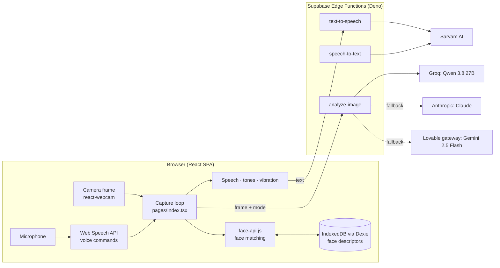

# NeuroNarrator

An assistive web app for blind and visually impaired people. It watches through the phone camera, describes the scene out loud, reads printed text, reads Indian Rupee notes, helps find a named object, and recognises people the user has saved. It is operated by touch and voice rather than buttons.

> **Status:** prototype. The original version was generated with [Lovable](https://lovable.dev) and is published by its owner at <https://neuronarrator.lovable.app>. This repository keeps that full commit history and adds later fixes (see [Credits](#credits)).

## Features

| Feature | How it works |
|---|---|
| **Scene description** (Standard mode) | Every captured frame is described in one or two casual sentences, with rough distances and positions. |
| **Text reader** (Read mode) | Say "read this" or "what does it say" (or "Neuro read" hands-free). The app says what kind of thing it is, such as "Looks like a menu", then reads the text out and shows it large on screen. |
| **Currency reader** | Identifies Indian Rupee notes and coins and says the total. |
| **Item finder** | "Find my keys": a high ping and vibration when the item is visible, a low thrum when it isn't, and spoken directions when found. |
| **Hazard alerts** | The model rates each scene 1–10. Above 7 the app says "Warning", vibrates an SOS-style pattern, shows a banner and plays alarm tones. |
| **Face recognition** | Runs in the browser with face-api.js. Say "Neuro remember Ronit" while someone is in view, and later descriptions use their name, relationship and how long since you last saw them. |
| **Voice control** | Hold anywhere to speak a command (push-to-talk); it keeps listening until you let go: "describe", "read this", "count notes", "find my keys". Hands-free, say "Neuro describe", "Neuro read", "Neuro currency" or "Neuro find my keys". The app repeats back what it heard. Recognition uses the browser's Web Speech API tuned for Indian English (`en-IN`). |
| **Speech output** | Sarvam AI text-to-speech; falls back to the browser's built-in voice if that fails. |
| **Haptic Braille** | The first words of a hazard warning are vibrated as Braille patterns. |

## Architecture



There is no server-side database and no user login. Everything the app remembers (saved faces) lives in the browser's IndexedDB.

### How a frame flows through the app

1. The user taps the screen. The camera starts, and a frame is captured about 1.5 s later.
2. In Standard mode, face-api.js looks for a face first, with a 2 s timeout. A match within Euclidean distance 0.55 of a saved face adds that person's name, relation and last-seen time to the request. An unknown face pauses narration for 5 s so the user can say "Neuro remember <name>".
3. The frame goes to the `analyze-image` edge function, which picks a system prompt for the mode and asks a vision model for JSON (`description`, `text_content`, `hazards`, `priority`, and `found` in finder mode). It tries Groq's Qwen 3.8 27B, then Claude, then Gemini, depending on which API keys are configured. (The original Llama 4 Scout and Maverick models were shut down by Groq in 2026.)
4. The browser speaks the answer and plays tones or vibration based on the mode and priority.
5. **The next frame is captured only after speech finishes**, so descriptions never overlap. A watchdog restarts the loop if analysis hangs for more than 15 s or speech for more than 12 s.

## Tech stack

| Layer | Technology |
|---|---|
| Frontend | React 18, TypeScript, Vite, Tailwind CSS, shadcn/ui, framer-motion, react-webcam |
| Browser APIs | Web Speech API (recognition), Web Audio API (tones, TTS playback), Vibration API, IndexedDB |
| On-device ML | face-api.js (SSD MobileNet v1 + TinyFaceDetector, 68-point landmarks, 128-d face descriptors); Dexie for storage |
| Backend | Supabase Edge Functions (Deno), hosted on Lovable Cloud |
| Vision models | Groq `qwen/qwen3.8-27b`; Anthropic `claude-opus-5-5` (optional fallback); Lovable gateway `google/gemini-2.5-flash` (fallback) |
| Speech | Sarvam AI `bulbul:v2` (TTS), `saarika:v2.5` (STT) |
| Testing | Vitest, Testing Library, jsdom |

## Project structure

```
src/
  pages/Index.tsx               capture loop, mode handling, watchdog, push-to-talk wiring
  components/LiveCamera.tsx     camera feed, frame capture, camera flip
  components/PushToTalkOverlay.tsx  full-screen touch target
  components/FaceRecognitionOverlay.tsx, AddPersonModal.tsx  face UI
  hooks/useFaceRecognition.ts   face-api.js detection, matching, descriptor blending
  hooks/useNeuroVoice.ts        TTS via edge function + browser fallback
  hooks/useVoiceControl.ts      push-to-talk command parsing
  hooks/useVoiceCommand.ts      always-on "Neuro …" listener
  hooks/useFinderSound.ts, useHazardSound.ts, useHaptics.ts, useHapticBraille.ts
  lib/faceDatabase.ts           Dexie schema (NeuroMemory, v1 → v2 migration)
  services/vision.ts            client for analyze-image
supabase/functions/
  analyze-image/                vision prompts, provider fallback, JSON parsing
  text-to-speech/               Sarvam TTS proxy
  speech-to-text/               Sarvam STT proxy (used by the Add Person dialog)
```

## Running locally

Requirements: Node.js 18+ and npm.

```bash
npm ci
npm run dev        # http://localhost:8080
```

Chrome is recommended, because the Web Speech API is limited in other browsers. Camera and microphone need `localhost` or HTTPS.

The committed `.env` points the frontend at the original Lovable Cloud project:

| Variable | Purpose |
|---|---|
| `VITE_SUPABASE_URL` | Supabase project URL |
| `VITE_SUPABASE_PUBLISHABLE_KEY` | Supabase anon (publishable) key. It is meant to be public in a browser app. |
| `VITE_SUPABASE_PROJECT_ID` | Supabase project ID |

To use your own backend, create a Supabase project, deploy the functions (`supabase functions deploy`) and set their secrets:

| Secret | Used by | Required |
|---|---|---|
| `GROQ_API_KEY` | analyze-image | at least one vision key |
| `ANTHROPIC_API_KEY` | analyze-image (Claude fallback) | optional |
| `LOVABLE_API_KEY` | analyze-image (Gemini fallback, Lovable Cloud only) | optional |
| `SARVAM_API_KEY` | text-to-speech, speech-to-text | optional; without it the app uses browser TTS |

## Edge function API

The frontend calls all three with `supabase.functions.invoke`. Each returns JSON and answers CORS preflight.

| Function | Request | Success response | Errors |
|---|---|---|---|
| `analyze-image` | `{ imageBase64, mode: "general"\|"reader"\|"currency"\|"finder", knownFaces?, previousDescription?, targetItem? }` | `{ text_content, description, hazards[], priority 1–10, found? }` | 400 invalid input · 500 no provider configured · 503 all models failed |
| `text-to-speech` | `{ text, speaker?: "anushka"\|"abhilash" }` (text truncated to 500 chars) | `{ audioBase64 }` | 400 · 429 rate limited · 502 Sarvam error · 504 timeout (8 s) |
| `speech-to-text` | `{ audioBase64 (webm), language_code?: "en-IN" }` | `{ transcript }` | 400 · 502 Sarvam error |

## Testing

```bash
npm test           # Vitest unit tests
npm run lint
npm run build
```

The tests cover push-to-talk command parsing, the hands-free "Neuro read" matcher, and face registration from a voice command. The edge functions have no automated tests. They were checked by running them locally in Deno and sending requests.

## Security and privacy notes

- **Camera frames leave the device.** Face descriptors stay in IndexedDB, but every analysed frame, including any faces in it, is sent to the vision provider. In Standard mode the names and relations of recognised people are sent too.
- **The edge functions are unauthenticated** (`verify_jwt = false`, CORS `*`). Anyone who finds the URLs can use the configured API quotas. Input is validated and size-limited, but there is no per-user rate limiting.
- The text-to-speech rate limit (1 request per 2 s) is kept in memory and keyed on the Authorization header. Every user sends the same public anon key, so they all share one limit.
- The committed Supabase key is the anon key, which is public by design. Provider API keys live only as function secrets.

## Known limitations

- The watchdog starts a new capture after 15 s without cancelling the stuck request. A late response can then still be spoken.
- The TTS request's `AbortController` is never passed to the fetch, so stopping speech doesn't cancel a request already in flight.
- face-api.js is unmaintained, loads its model weights from a third-party GitHub Pages URL, and makes the JS bundle about 1.45 MB.
- Flipping the camera during face detection can log an uncaught face-api.js error. The app keeps running.
- Speech goes through Sarvam text-to-speech, which cuts text at 500 characters, so a long page in Read mode is only partly read aloud. The full text is still shown on screen.
- `npm run lint` still reports issues in the original code (mostly `any` types and empty `catch` blocks).

## Credits

- **Concept:** Gannoji Sathvik came up with the NeuroNarrator idea.
- **Original implementation:** G. Ronit Reddy ([Ronitreddy10/neuronarrator](https://github.com/Ronitreddy10/neuronarrator)). The app was built with Lovable, and most commits in that history were made by Lovable's bot.
- **Later changes in this repository** (Gannoji Sathvik, with Claude as a coding assistant): fixed the lockfile so `npm ci` works, fixed saving a face from the "Neuro remember" voice command, made the camera and face-panel buttons clickable above the push-to-talk overlay, added Claude as a vision fallback, added input validation to the edge functions, and added unit tests.
